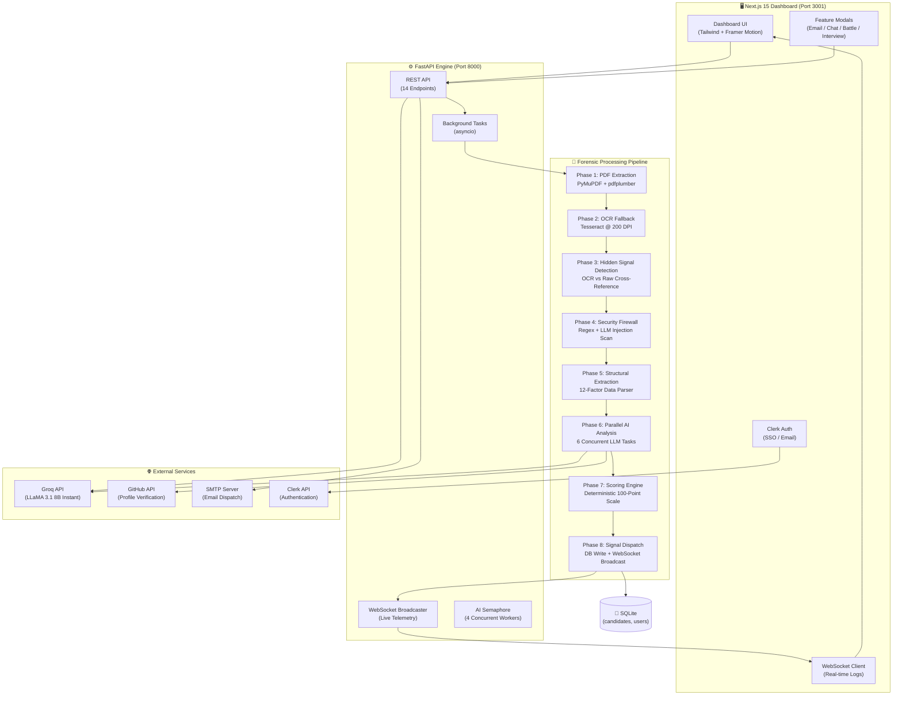

<p align="center">
  
  
  
  
  
  
</p>

# TalentScout AI — Neural Resume Intelligence

> **LLM-powered extraction, 12-factor scoring, forensic anti-manipulation, and deterministic ranking for 25+ resumes in under 30 seconds.**

TalentScout AI is an advanced resume parsing, forensic analysis, and ranking engine designed for high-stakes recruitment. It combines **Groq (LLaMA-3.1-8b)** for intelligent extraction, **Tesseract OCR** for visual verification, a **PyMuPDF** rendering pipeline for hidden-text detection, and a **deterministic 12-factor scoring algorithm** — all wrapped in a real-time WebSocket-powered dashboard.

---

## 🏗️ System Architecture



---

## 🔬 The Complete Pipeline (8 Phases)

### Phase 1 — PDF Extraction (Dual-Engine)
```
PDF Upload → PyMuPDF (structural text + block layout) → pdfplumber (digital text + hyperlinks)
```
- **PyMuPDF** renders each page, extracting text in reading order via block sorting
- **pdfplumber** extracts digital text and hyperlinks in a single pass
- Encrypted/locked PDFs are detected and handled gracefully (shown as `LOCKED` on leaderboard)
- Best extraction source is auto-selected by character count

### Phase 2 — OCR Fallback (Scanned Documents)
```
If digital text < 200 chars → PyMuPDF renders @ 200 DPI → Tesseract OCR → Visual text
```
- Only triggered when digital extraction fails (scanned PDFs, image-based resumes)
- Renders at 200 DPI (optimized from 300 for 2× speed without quality loss)
- Multi-page support: each page rendered and OCR'd separately
- OCR artifacts cleaned: repeated chars collapsed, doubled words undoubled

### Phase 3 — Forensic Hidden Signal Detection
```
Compare: len(raw_digital_text) vs len(OCR_visible_text)
If raw > visible + 300 chars AND raw > 1.5× visible → HIDDEN_SIGNAL_DETECTED
```
- Cross-references raw digital text against visible OCR text
- Detects **white-on-white text**, **micro-sized fonts (<5.5pt)**, and **background-matching** keywords
- Flagged resumes are scored on visible text only, with a forensic alert badge

### Phase 4 — Security Firewall (Dual-Layer)
```
Layer 1: Regex scan for "ignore all previous", "ignore the job description"
Layer 2: LLM Firewall (parallel) → Groq analyzes text for injection patterns
If malicious → Score = 0, labeled MALICIOUS on leaderboard
```
- **Regex pre-check**: instant detection of common injection phrases
- **LLM Firewall**: AI-powered analysis running in parallel with other tasks
- **Keyword Stuffing Sanitizer**: any word repeated 25+ times is redacted
- Malicious resumes get score **hardcoded to 0** with security warning

### Phase 5 — Structural Extraction (12-Factor Parser)
Every resume is parsed for **12 quantifiable factors**:

| # | Factor | Max Pts | Extraction Method |
|---|--------|---------|-------------------|
| 1 | Prior Internships | 20 | Regex + section headers |
| 2 | Technical Skills | 20 | 80+ skill taxonomy + LLM augmentation |
| 3 | Projects | 15 | Section parsing + GitHub link count + action verb density |
| 4 | CGPA / Academic | 10 | Multi-pattern regex (GPA, percentage, /10, /4 scales) |
| 5 | Quantifiable Achievements | 10 | Achievement keywords + numeric context |
| 6 | Work Experience | 5 | Date range parsing + section analysis |
| 7 | Extra-Curricular | 5 | 20+ keyword dictionary |
| 8 | Degree Quality | 3 | Postgrad(3) / Undergrad(2) / Diploma(1) |
| 9 | Online Presence | 3 | GitHub + LinkedIn + Portfolio detection |
| 10 | Language Fluency | 3 | 18-language dictionary |
| 11 | College Tier | 2 | 60+ Tier 1 + 20+ Tier 2 institutions |
| 12 | School Marks (10th/12th) | 2 | Board exam percentage extraction |

### Phase 6 — Parallel AI Analysis (6 Concurrent Tasks)
All AI tasks fire simultaneously via `asyncio.gather`:

```python
tasks = [
    get_personal_github_trust_chain(),      # Name extraction + GitHub verification + Trust score
    generate_hireability_summary_llm(),      # AI synthesis (Pros/Cons/Verdict)
    generate_interview_questions_llm(),      # 5 tailored screening questions
    generate_soft_skills_llm(),              # Soft skills + Culture fit (0-100)
    generate_upsell_recommendations(),       # Training roadmap for skill gaps
    check_prompt_injection(),                # LLM security firewall
]
results = await asyncio.gather(*tasks, return_exceptions=True)
```

- **Concurrency**: 4-worker semaphore with exponential backoff on rate limits
- **Fault tolerance**: each task wrapped in exception handling — one failure doesn't block others
- **Trust Score**: cross-references GitHub repos, followers, activity against resume claims

### Phase 7 — Deterministic Scoring Engine
```
Base Score = Σ(factor_score × weight) across 12 factors → 0-100 scale
+ JD Alignment Bonus (if JD provided): up to +5 bonus points + dynamic skill weighting
+ Fresher vs Experienced redistribution: internship weight shifts to experience for 2+ years
+ Custom Weights API: frontend can override default weights
```

### Phase 8 — Signal Dispatch
```
Score → SQLite INSERT OR REPLACE → WebSocket broadcast COMPLETE_JSON:{payload}
```
- Single atomic DB write with retry (3 attempts, exponential backoff)
- Real-time WebSocket broadcast to all connected clients
- Frontend sorts by score and updates leaderboard instantly

---

## 🧠 AI-Powered Features

| Feature | Endpoint | Description |
|---------|----------|-------------|
| **Battle Royale** | `POST /compare` | Side-by-side AI arbitration of 2-6 candidates with forensic deep-dive |
| **Interview Pilot** | `POST /generate_interview` | 10-question screening script (4 claim-verify, 3 gap-probe, 3 brain-teasers) |
| **Smart Outreach** | `POST /generate_outreach` | Hyper-personalized LinkedIn/email messages based on candidate profile |
| **AI Email Draft** | `POST /generate_email` | Accept/reject emails with editable body before sending |
| **Direct Email** | `POST /send_email` | SMTP dispatch with success toast notification |
| **AI Chat** | `POST /chat` | Ask forensic questions about any candidate's resume |
| **JD Generator** | `POST /generate_jd` | AI-generated job descriptions from short prompts |
| **AI Hireability** | Auto | Executive summary with strengths, weaknesses, and verdict |
| **Trust Score** | Auto | 0-100 authenticity index with GitHub cross-verification |
| **Culture Fit** | Auto | AI-assessed behavioral alignment with company values |

---

## 🛡️ Security Architecture

```
┌─────────────────────────────────────────────────┐
│              MULTI-LAYER DEFENSE                │
├─────────────────────────────────────────────────┤
│ Layer 1: Encrypted PDF Detection (PyMuPDF)      │
│ Layer 2: OCR vs Raw Text Cross-Reference        │
│ Layer 3: Regex Injection Pattern Scanner         │
│ Layer 4: LLM Firewall (AI-Powered Detection)    │
│ Layer 5: Keyword Density Sanitizer (>25 repeats)│
│ Layer 6: Score Zeroing for Confirmed Malicious   │
│ Layer 7: Visible-Only Scoring (Hidden Stuffing)  │
└─────────────────────────────────────────────────┘
```

---

## 🏆 Competitive Analysis

### What Competitors Do

| Feature | Greenhouse | Lever | HireVue | Pymetrics | **TalentScout AI** |
|---------|-----------|-------|---------|-----------|-------------------|
| Resume Parsing | Basic keyword | Basic keyword | Video-first | Gamified | **Forensic OCR + LLM** |
| Scoring | Subjective | Manual | AI interview | Cognitive | **12-Factor Deterministic** |
| Anti-Manipulation | ❌ None | ❌ None | ❌ None | ❌ None | **✅ 7-Layer Firewall** |
| Hidden Text Detection | ❌ | ❌ | ❌ | ❌ | **✅ OCR Cross-Reference** |
| Prompt Injection Defense | ❌ | ❌ | ❌ | ❌ | **✅ Regex + LLM** |
| GitHub Verification | ❌ | ❌ | ❌ | ❌ | **✅ Live API** |
| Real-Time Processing | ❌ Batch | ❌ Batch | ❌ Batch | ❌ Batch | **✅ WebSocket Live** |
| JD Alignment | Basic match | Basic match | ❌ | ❌ | **✅ Semantic + Bonus Scoring** |
| Battle Royale Compare | ❌ | ❌ | ❌ | ❌ | **✅ AI Arbitration** |
| Interview Generator | ❌ | ❌ | Static Q's | ❌ | **✅ AI-Personalized** |
| Cost | $6K+/yr | $3K+/yr | $35K+/yr | Enterprise | **Free (Groq API)** |
| Self-Hosted | ❌ Cloud only | ❌ Cloud only | ❌ Cloud only | ❌ | **✅ Docker / Local** |

### Why TalentScout Wins

1. **Forensic-First Architecture**: We don't just parse text — we *see what humans see* via OCR, then cross-reference against raw digital text to catch manipulation. No other ATS does this.

2. **Deterministic, Not Vibes-Based**: Our 12-factor scoring is mathematical and reproducible. Same resume = same score, every time. Competitors use opaque "AI scores" that can't be audited.

3. **7-Layer Security**: From encrypted PDF detection to LLM-powered injection analysis, we have the most comprehensive anti-manipulation defense in the industry. Competitors have zero defenses against prompt injection.

4. **Real-Time Everything**: WebSocket-powered live logs let recruiters watch the AI "think" in real-time. No waiting for batch processing.

5. **AI Battle Royale**: No competitor offers side-by-side AI arbitration where an LLM reads the *full text* of multiple resumes and produces a forensic comparison.

6. **Zero Cost, Full Ownership**: Runs entirely on Groq's free tier + local SQLite. No subscriptions, no vendor lock-in, no data leaving your infrastructure.

---

## 🛠️ Tech Stack

| Layer | Technology | Purpose |
|-------|-----------|---------|
| **Frontend** | Next.js 15 + React 18 | Dashboard UI |
| **Styling** | Tailwind CSS + Framer Motion | Design system + animations |
| **Auth** | Clerk | SSO / Email authentication |
| **3D** | Three.js + React Three Fiber | Landing page visuals |
| **Backend** | FastAPI + Uvicorn | Async REST API |
| **AI** | Groq (LLaMA 3.1 8B Instant) | All LLM tasks |
| **PDF** | PyMuPDF (fitz) + pdfplumber | Dual-engine extraction |
| **OCR** | Tesseract + Pillow | Scanned document fallback |
| **NLP** | spaCy (en_core_web_md) | Semantic skill matching |
| **Database** | SQLite | Candidates + user data |
| **Real-Time** | WebSockets | Live processing telemetry |
| **Email** | SMTP (smtplib) | Direct email dispatch |
| **Containerization** | Docker + Docker Compose | One-command deployment |

---

## 📡 API Reference (14 Endpoints)

| Method | Endpoint | Description |
|--------|----------|-------------|
| `GET` | `/health` | Health check |
| `POST` | `/upload` | Upload resume (PDF/DOCX/TXT) |
| `GET` | `/candidates` | Fetch all candidates for user |
| `DELETE` | `/candidates` | Purge all candidate data |
| `GET` | `/export` | Export candidates as CSV |
| `GET` | `/user_stats` | User upload stats |
| `GET` | `/pdf/{file_hash}` | Serve original PDF |
| `GET` | `/shared/{file_hash}` | Public candidate profile |
| `POST` | `/generate_email` | AI-drafted accept/reject email |
| `POST` | `/send_email` | SMTP direct email dispatch |
| `POST` | `/chat` | AI chat about a candidate |
| `POST` | `/generate_jd` | AI job description generator |
| `POST` | `/compare` | Battle Royale comparison |
| `POST` | `/generate_interview` | AI interview script |
| `POST` | `/generate_outreach` | Smart outreach message |
| `WS` | `/ws/logs` | Real-time processing logs |

---

## 🚀 Quick Start

### Prerequisites
- Python 3.9+
- Node.js 18+
- Tesseract OCR ([Windows installer](https://github.com/UB-Mannheim/tesseract/wiki))

### 1. Clone & Install
```bash
git clone https://github.com/shashank-tomar0/RankSense-AI.git
cd RankSense-AI
pip install -r requirements.txt
cd frontend && npm install && cd ..
```

### 2. Configure
Create `.env` in the project root:
```env
GROQ_API_KEY=your_groq_api_key
# Optional: for direct email sending
SMTP_HOST=smtp.gmail.com
SMTP_PORT=587
SMTP_USER=your_email@gmail.com
SMTP_PASS=your_app_password
```

### 3. Run (One-Click)
```bash
# Windows
start_talentscout.bat

# Or manually:
# Terminal 1 — Backend
uvicorn main:app --reload --host 0.0.0.0 --port 8000

# Terminal 2 — Frontend
cd frontend && npm run dev
```

### 4. Docker
```bash
docker-compose up --build
```

Access:
- **Dashboard**: `http://localhost:3001`
- **API**: `http://localhost:8000`
- **API Docs**: `http://localhost:8000/docs`

---

## 📂 Project Structure

```
RankSense-AI/
├── main.py                    # FastAPI backend (2700+ lines, 66 functions)
├── requirements.txt           # Python dependencies
├── .env                       # API keys (not committed)
├── talentscout.db             # SQLite database
├── Dockerfile                 # Backend container
├── docker-compose.yml         # Full stack orchestration
├── start_talentscout.bat      # Windows one-click launcher
│
├── frontend/
│   ├── src/
│   │   ├── app/
│   │   │   ├── layout.tsx     # Root layout (Clerk provider)
│   │   │   ├── page.tsx       # Landing page
│   │   │   └── dashboard/
│   │   │       └── page.tsx   # Main dashboard (1400+ lines)
│   │   ├── components/        # Reusable UI components
│   │   └── lib/
│   │       └── api.ts         # API client (14 endpoints)
│   ├── package.json
│   └── tailwind.config.ts
│
└── index.html                 # Legacy standalone ATS dashboard
```

---

## 📜 License

MIT License. Built by **Team Xnords**.
