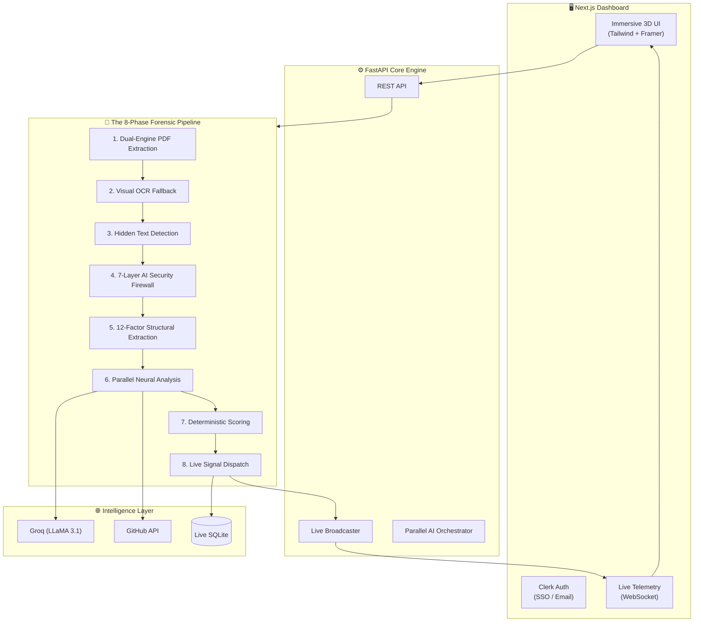
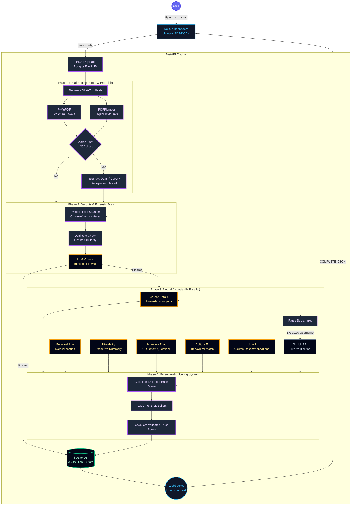

<p align="center">
  
  
  
  
</p>

# TalentScout AI — Neural Resume Intelligence

> **We don't just "read" resumes. We interrogate them.** TalentScout AI is an advanced, anti-manipulation hiring engine designed to evaluate 25+ resumes in under 10 seconds, scoring candidates deterministically across 12 factors while destroying AI-generated prompt injections and hidden text hacks.

In a world where standard ATS systems rely on dumb keyword matching—allowing candidates to cheat by hiding microscopic text in their PDFs—TalentScout acts as a **Forensic Auditor**, bringing absolute truth and transparency back to hiring.

---

## 🏗️ System Architecture

Our lightning-fast architecture orchestrates real-time analysis, parallel neural networks, and live WebSocket telemetry.



---

## ⚡ Real-Time Upload Architecture



---

## 📊 The 12-Factor Deterministic Scoring System

Our engine uses a proprietary, 100-point deterministic rubric that eliminates bias and ensures every resume is judged by the same rigorous standard.

| Factor | Weight | How It's Calculated |
|--------|:---:|-------|
| **Internships** | 20 pts | `min(count / 2, 1.0) × 20`. Padding protection catches fakes <20 chars. |
| **Technical Skills** | 20 pts | Base count + Advanced Domain Bonus + SpaCy JD Vector Match (+5 pts). |
| **Projects** | 15 pts | min(count/3, 1.0) × 12 + Adv Tech (+2) + quantified Impact (+3). |
| **CGPA / Academic** | 10 pts | Auto-detects 4.0 vs 10.0 scale, normalizes to percentage brackets. |
| **Achievements** | 10 pts | Quantified wins ("ranked 3rd") earn 1x, Publications earn 2x. |
| **Work Experience** | 5 pts | Years of experience, capped at 5. Includes a -2pt Job-Hopper Penalty. |
| **Extra-Curricular** | 5 pts | Hackathons, clubs, volunteering, and leadership roles. |
| **Degree Quality** | 3 pts | Advanced degrees (PhD/Masters) score 3/3; Bachelors score 2/3. |
| **Online Presence** | 3 pts | 1pt each for verified GitHub, LinkedIn, and Portfolio links. |
| **Languages** | 3 pts | Detection of up to 3 spoken/written languages. |
| **College Tier** | 2 pts | Tier-1 (IIT/NIT/BITS) vs Tier-2 vs Tier-3 bracket analysis. |
| **School Marks** | 2 pts | Percentage brackets for 10th/12th grade scores. |

### 🛠️ Neural Calibration Layers (Dynamic Logic)

1.  **Fresher vs. Experienced Logic**: For senior candidates (2+ years), the 20pt Internship weight dynamically transfers to **Work Experience**, ensuring veterans aren't penalized for old internships.
2.  **Prestige Multiplier**: Automated detection of FAANG/Top-Tier companies (+8% boost) and Tier-1 Universities (+5% boost).
3.  **Skill-Project Consistency**: We cross-reference claimed skills against project descriptions. Highly consistent profiles earn a **+3 point bonus**.
4.  **Completeness Multiplier**: Up to **+16% total boost** for resumes with high data density (links + projects + languages + achievements).

---

## 🏆 TalentScout AI vs. SAH (The Competitive Edge)

| Capability | TalentScout AI | Competitor (SAH) |
|------------|:---:|:---:|
| **Underlying Engine** | **Neural LLM (LPU Powered)** | Pure Regex / String Matching |
| **Concurrency** | **6x Parallel AI Tasking** | Sequential Batch Only |
| **Security Firewall** | **7-Layer Anti-Fraud Engine** | Basic Font Detection Only |
| **Verification** | **Live GitHub API Trust Score** | ❌ None (Assumes Truth) |
| **Extraction** | **Dual-Engine + OCR Fallback** | ❌ No OCR for Scanned PDFs |
| **Interactivity** | **AI Battle Royale Arbitration** | ❌ None |
| **Speed** | **Real-Time WebSocket Streams** | ❌ Batch Table Rendering |
| **JD Match** | **SpaCy Vector Cosine Similarity** | ❌ Basic Keyword Counting |
| **Architecture** | Production Next.js + FastAPI | Basic Streamlit App |

**We Win Because:** While SAH acts as a simple parser, TalentScout is an **AI-powered forensic co-pilot.** We catch prompt injections, verify candidate claims via external APIs, and use high-speed parallel LLMs to generate hireability reports that standard parsers simply cannot produce.

---


## 🚀 Setup & Deployment

TalentScout AI is built for radical simplicity and speed.

### Prerequisites
- Python 3.10+
- Node.js 18+
- Groq API Key
- Clerk API Keys

### Quick Start
1. **Clone the repository:**
   ```bash
   git clone https://github.com/shashank-tomar0/RankSense-AI.git
   cd RankSense-AI
   ```

2. **Backend Setup:**
   ```bash
   python -m venv venv
   source venv/bin/activate  # Or `venv\Scripts\activate` on Windows
   pip install -r requirements.txt
   uvicorn main:app --reload --port 8000
   ```

3. **Frontend Setup:**
   ```bash
   cd frontend
   npm install
   npm run dev -- -p 3001
   ```

*(Requires `.env` files configured in both roots with your Groq and Clerk keys).*
