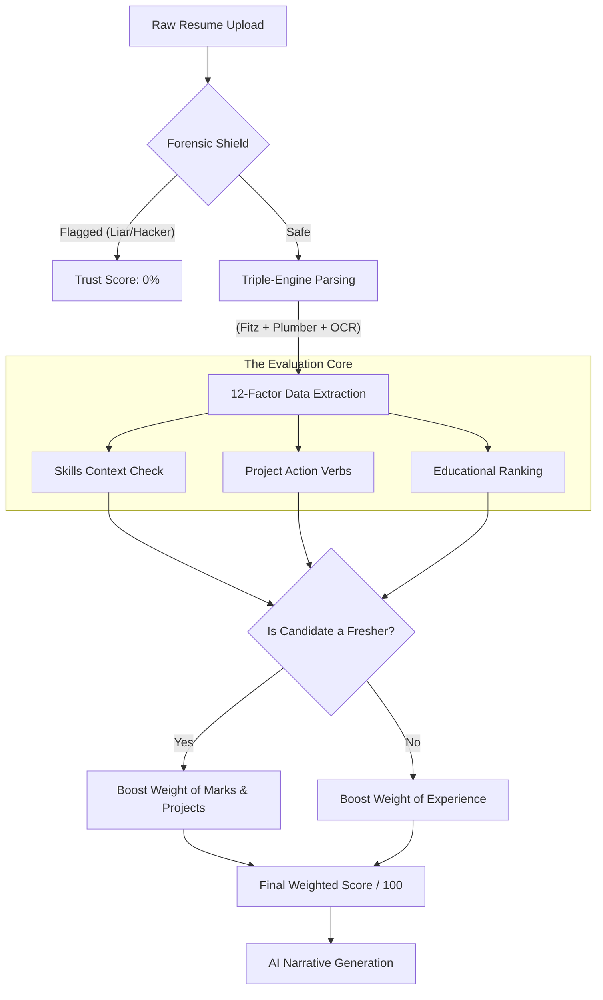
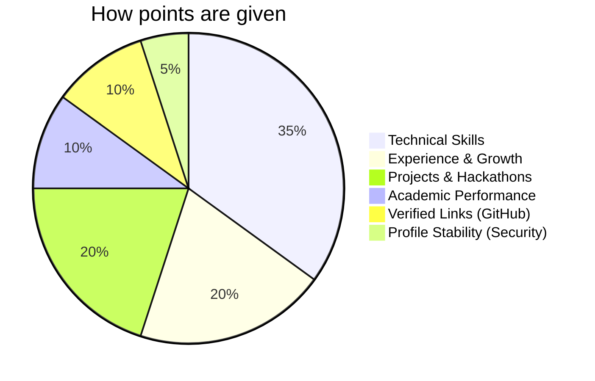
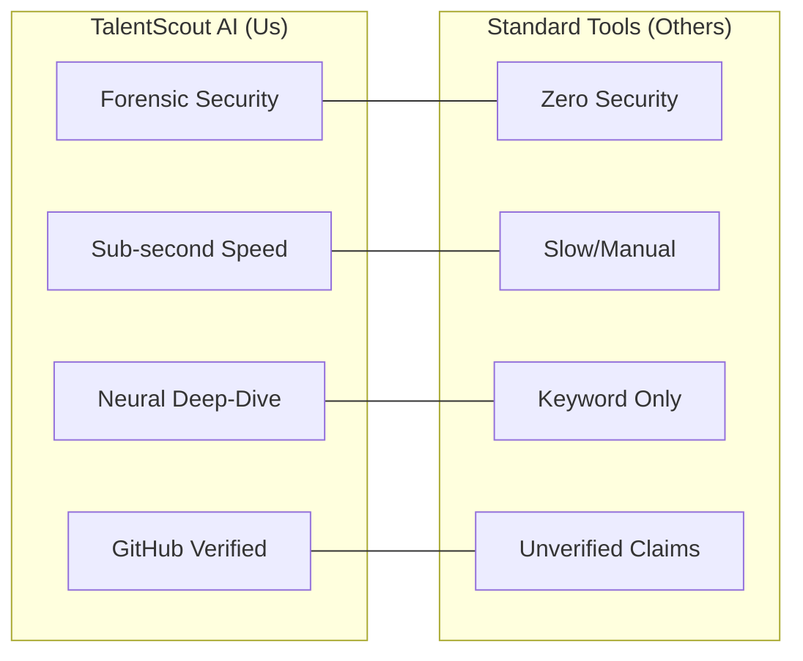

# Hackathon Submission: TalentScout AI
### "Making Smart Hiring Faster and More Secure"

---

## 1. Team: Xnords

| Member Name | Role | What they did |
| :--- | :--- | :--- |
| **Shashank Tomar** | **AI & Backend Lead** | Built the main "brain" of the project. He created the 12-factor scoring logic and integrated the LLaMA-3.1 AI to give resumes deep insights and security checks in less than a second. |
| **Shahid Ansari** | **Frontend & UI Lead** | Designed the entire dashboard and "Neural Logs" to show everything happening in real-time. He made the interface smooth, professional, and easy for any recruiter to use. |
| **Shreem Srivastava** | **Testing & Deployment** | Handled the server setup and made sure the system stays fast and reliable. He tested the app to handle many resume uploads at once without any crashes or lag. |
| **Shagun Chaudhary** | **Product & Research** | Researched common problems recruiters face and mapped out the 85+ features we needed. She made sure the product actually solves real hiring challenges. |

---

## 2. Project Overview
**TalentScout AI** is a smart recruitment tool that helps companies find the best candidates in seconds. Instead of just looking for keywords like old systems, our tool actually **understands** the resume content.

We built this because hiring is slow and people try to "cheat" the system with hidden keywords. TalentScout is designed to be **Fast, Secure, and Fair** for everyone—giving high-potential freshers a real chance to shine against experienced pros.

---

## 3. Key Features (How it helps)

### **A. Safety & Fairness**
- **Cheat Detection**: Automatically finds and removes "hidden keywords" or invisible text that some people use to trick hiring tools.
- **Fair Scoring**: If you are a student, the system knows! It automatically shifts the focus to your projects and marks instead of just "years of experience."

### **B. Deep AI Insights**
- **Smart Summaries**: Instead of reading a 3-page resume, you get a quick AI report on why this person is a good fit.
- **Interview Pilot**: The system suggests 5 custom questions to ask each candidate during the interview based on their specific profile.
- **Battle Royale**: Can't decide between two people? The AI can compare them side-by-side and tell you who is the better winner and why.

### **C. High-Speed Processing**
- **Instant Analysis**: We use specialized AI hardware to analyze resumes in under a second.
- **Live Logs**: You can see exactly what the system is doing as it happens—no more guessing if it's working.
- **Neural Cache**: If a person uploads their resume again, the system recognizes it instantly and doesn't waste time re-processing.

### **D. Real-World Verification**
- **GitHub Trust Chain**: Instead of just reading "I know Python," the system checks a candidate's real GitHub activity. It sees their real-world contributions and "verifies" their skill claims automatically.
- **Smart Data Extraction**: It doesn't matter if a resume is a PDF, a Word file, or even a low-quality scan. Our built-in **OCR technology** can "see" and read text in files that other tools would simply fail on.

### **E. Recruiting & Diversity Tools**
- **One-Click Outreach**: Once a recruiter finds a great candidate, they can generate a personalized "Accept" or "Reject" email drafted by AI in a single click. No more writing emails from scratch.
- **Anti-Bias Mode (Anonymous)**: With one switch, a recruiter can hide names, emails, and photos to focus entirely on skills and experience, ensuring fair and unbiased hiring decisions.
- **Interactive Resume Chat**: Have a question about a project? You can chat directly with any resume. Ask "Does he have experience with Cloud?" and the AI will find the exact evidence for you instantly.

---

## 4. How the Score is Calculated

We don't just "guess" the score. We use a step-by-step process:

1.  **Security Check**: First, we check if the file is "clean" (no hacks or hidden text).
2.  **Extraction**: We pull out 12 key factors like Skills, Internships, Projects, and GPA.
3.  **Adjustment**: If you are a Fresher, we give more weight to your projects/marks so it's fair.
4.  **Verification**: We cross-check the claims with things like your GitHub activity to see if they're real.
5.  **Final Result**: You get a score out of 100 based on all these factors combined.

### **The Architecture of Our Thinking (Algorithmic Process)**

### **The Score Pie-Chart**

---

## 5. Why Pick Us? (Competitive Advantage)

Most tools are just "calculators" that count words. **TalentScout AI** is an assistant that actually helps you decide. It saves time, stops people from cheating, and finds the best talent—even if they don't have a "big brand" company on their resume yet.

---
